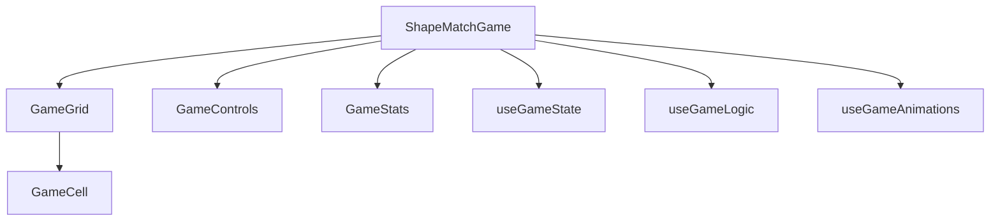

# System Patterns

## System Architecture

The Shape Match Game follows a modern React architecture with a clear separation of concerns:



### Key Components

1. **ShapeMatchGame** - Top-level orchestrator
   - Combines all subsystems
   - Manages game flow
   - Renders the UI container

2. **GameGrid** - Visual representation of game state
   - Renders the game board
   - Delegates to GameCell components
   - Handles layout and positioning

3. **GameCell** - Individual grid cells
   - Renders shapes, empty cells, or blockers
   - Manages selection and hover states
   - Handles animations for movement and matching

4. **GameControls** - User interface controls
   - Reset button
   - Board mode selection
   - Next board navigation

5. **GameStats** - Game statistics display
   - Move counter
   - Remaining boxes display

6. **VictoryModal** - End game celebration
   - Appears when all shapes are cleared
   - Shows final move count
   - Provides restart options

## Design Patterns in Use

### Custom Hooks Pattern
The game uses three primary custom hooks to manage different aspects of the game:

1. **useGameState** - Central state management
   - Grid state (2D array of shapes)
   - Selection state (currently selected cell)
   - Animation states (falling, matching)
   - Game progress (moves, board mode)
   - Initialization and reset logic

2. **useGameLogic** - Game mechanics
   - Movement validation
   - Box counting
   - Match detection
   - Game rules enforcement

3. **useGameAnimations** - Animation coordination
   - Gravity simulation
   - Cascade effects
   - Match animations
   - Timing coordination

### Component Composition
- Each component has a single responsibility
- Components are composed to build complex UI
- Props are used for data flow between components

### Immutable State Management
- State is never mutated directly
- Grid operations create new grid instances
- React's useState and useCallback for optimizations

## Critical Implementation Paths

### Game Loop Flow
```
User Click → Select Shape → Move Shape → Apply Gravity → Check Matches → Chain Reactions → Check Victory
```

### Animation Sequence
```
Move Animation → Gravity Animation → Match Animation → Cascade Animation → State Updates
```

### Match Detection Algorithm
1. Check adjacent cells for identical shapes after moves
2. Mark matching shapes for removal
3. Apply gravity after matches disappear
4. Repeat until no more matches are found

### Gravity Simulation
1. Scan grid from bottom to top
2. For each shape, check if space below is empty
3. If empty, move shape down and mark as falling
4. Repeat until no more movement occurs
5. Handle collision detection with other shapes and blockers

> **Note**: For detailed information about the game's physics system, match detection, and movement mechanics, see the dedicated [gameMechanicsAndPhysics.md](gameMechanicsAndPhysics.md) file.