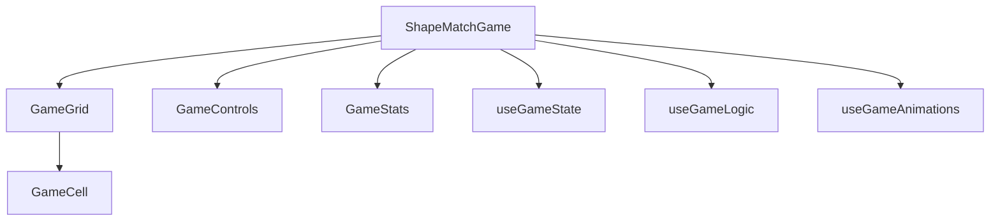

# Shape Match Game Documentation

## Table of Contents
- [Game Overview](#game-overview)
- [Installation](#installation)
- [Gameplay Mechanics](#gameplay-mechanics)
- [Technical Architecture](#technical-architecture)
- [Configuration Reference](#configuration-reference)
- [Component Breakdown](#component-breakdown)
- [State Management](#state-management)
- [Customization Guide](#customization-guide)
- [Development Workflow](#development-workflow)
- [API Documentation](#api-documentation)
- [Contributing](#contributing)
- [License](#license)

## Game Overview
A physics-based puzzle game with:
- 8×14 grid layout ([gameConstants.js:3](v1/src/utils/gameConstants.js:3))
- 6 shape types with color consistency ([gameConstants.js:11](v1/src/utils/gameConstants.js:11))
- Horizontal-only movement system ([ShapeMatchGame.jsx:60](v1/src/components/ShapeMatchGame.jsx:60))
- Cascade matching and chain reactions

```javascript
// Core movement validation
const isSameRow = row === selectedBox.row;
const isAdjacent = Math.abs(col - selectedBox.col) === 1;
```

## Installation
```bash
npm install
npm run dev
```
Production build:
```bash
npm run build
npm run preview
```

## Gameplay Mechanics
### Core Loop
1. Select colored shape
2. Move horizontally
3. Trigger gravity physics
4. Create matches
5. Chain reactions
6. Achieve victory


## Technical Architecture
### Component Structure


### Key Systems
- **Physics Engine**: Gravity simulation with collision detection
- **Animation System**: Coordinated CSS transforms
- **State Machine**: Managed through React hooks

## Configuration Reference
### Grid Settings ([gameConstants.js:2](v1/src/utils/gameConstants.js:2))
```javascript
export const GRID_CONFIG = {
  ROWS: 10,
  COLS: 14,
  CELL_SIZE: 48,
  CELL_GAP: 4
};
```

### Animation Timing ([gameConstants.js:201](v1/src/utils/gameConstants.js:201))
```javascript
export const ANIMATION_CONFIG = {
  HORIZONTAL_DELAY: 150,
  GRAVITY_PER_ROW: 150,
  MATCH_DURATION: 600
};
```

## Component Breakdown
### ShapeMatchGame.jsx ([v1/src/components/ShapeMatchGame.jsx:1](v1/src/components/ShapeMatchGame.jsx:1))
- Orchestrates game subsystems
- Handles core gameplay loop
- Manages component composition

### GameCell.jsx
- Renders individual grid cells
- Handles click interactions
- Manages animation states

## State Management
### useGameState Hook ([useGameState.js:61](v1/src/hooks/useGameState.js:61))
```javascript
export const useGameState = () => {
  const [grid, setGrid] = useState(() => initializeGrid());
  // ...other state values
};
```

| State Property       | Description                          |
|----------------------|--------------------------------------|
| `grid`               | 2D array representing game board     |
| `selectedBox`        | Currently selected cell coordinates  |
| `moves`              | Player move counter                  |

## Customization Guide
### Adding New Shapes
1. Modify [SHAPES array](v1/src/utils/gameConstants.js:11)
2. Update symbol-to-color mapping
3. Add corresponding CSS classes

Example new shape:
```javascript
{ symbol: '♥', color: 'text-rose-500' }
```

## Development Workflow
### Recommended Practices
- Use `useGameAnimations` for new animations
- Modify game logic in [gameLogicUtils.js](v1/src/utils/gameLogicUtils.js)
- Keep UI components in `/components/game`

### Testing Strategies
```bash
npm run test
```

## API Documentation
### useGameLogic Hook
```javascript
const {
  moveBox,
  isValidMoveTarget,
  getRemainingBoxes
} = useGameLogic();
```

| Method               | Parameters                          | Returns            |
|----------------------|-------------------------------------|--------------------|
| `moveBox`            | (fromRow, fromCol, toRow, toCol)    | void               |
| `isValidMoveTarget`  | (row, col)                          | boolean            |

## Contributing
1. Fork repository
2. Create feature branch
3. Submit PR with:
   - Updated documentation
   - Passing tests
   - CHANGELOG entry

## License
MIT License - See [LICENSE](v1/LICENSE)